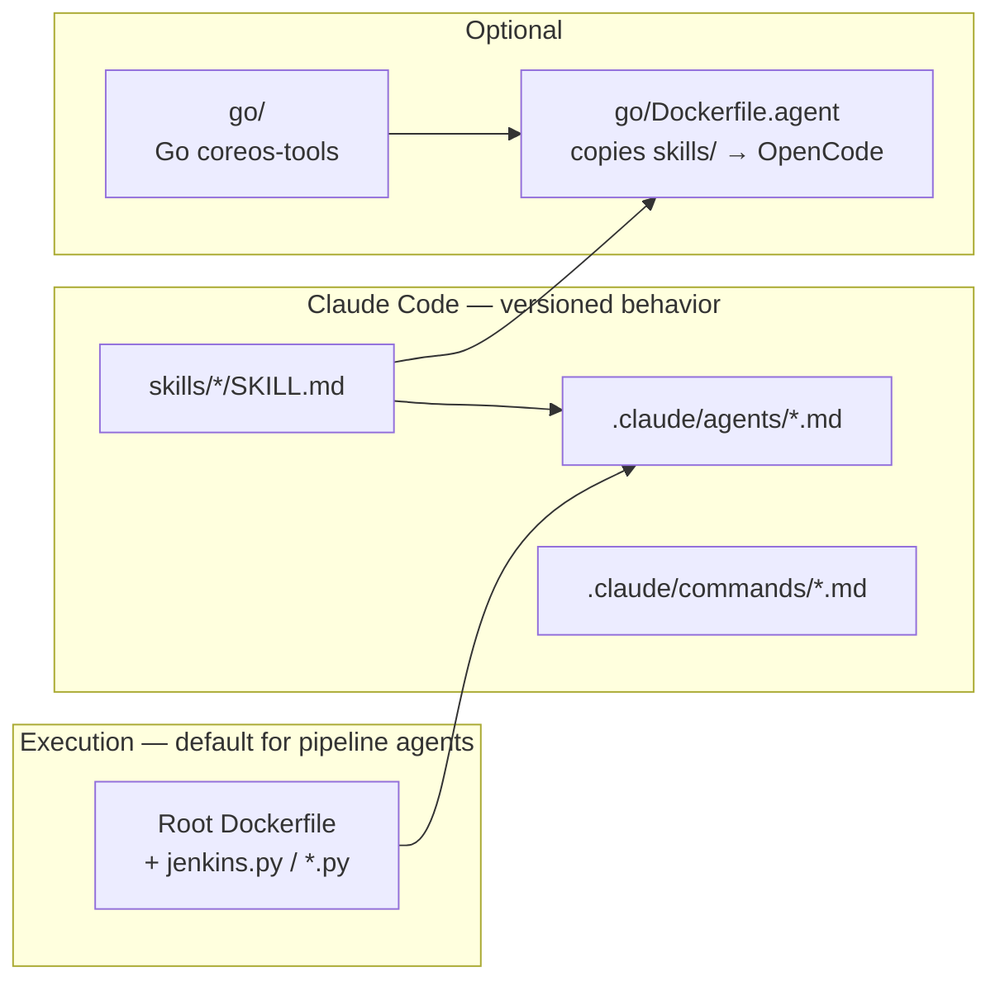

# CLAUDE.md

This file provides guidance to Claude Code (claude.ai/code) when working with code in this repository.

# Instructions

## Mandatory: RHCOS / Jenkins agent routing

When the user’s message is about **RHEL CoreOS / RHCOS / Jenkins / the `build` pipeline / pipeline health / failures / triage** (and not unrelated repo work such as editing unrelated code, pure CVE workflow without Jenkins, or `get_rhcos_image.py` only), **do not** answer as a generic assistant alone.

**Always:**

1. **Classify** the intent using the table below.
2. **Read** the matching file(s) under `.claude/agents/` (e.g. `pipeline-monitor.md`) at the **start** of the response so behavior matches the repo.
3. **Act in that agent’s persona**: follow its checks, tools, and **output format** (e.g. “Pipeline Monitor — Summary”).
4. **Hand off** in text: tell the user which **@agent** or slash command to use next (e.g. after monitor → suggest **@pipeline-investigator** or **`/pipeline-triage`**).

**Multi-intent in one message** (e.g. “current pipeline status **and** triage the latest failure”): run **in order** — **pipeline-monitor** (discovery) **then** **pipeline-investigator** (ordered triage for the build you identified), in the **same turn** if reasonable, without asking permission to switch personas.

| User intent (examples) | Read and follow |
|------------------------|-----------------|
| Current / latest build, pipeline status, what’s red, “look at RHCOS pipeline”, Jenkins health, recent failures overview | `.claude/agents/pipeline-monitor.md` |
| Root cause, triage, classify, investigate build #N, analyze console log, “why did it fail” | `.claude/agents/pipeline-investigator.md` + `skills/pipeline-triage-workflow/SKILL.md` — if job/build missing, do **monitor** discovery first |
| Jira / COS subtask / draft ticket / handoff / routing to RHEL | `.claude/agents/pipeline-handoff.md` |
| Similar **GitLab** tracker issues, flake history, dedupe in `pipeline-failure-tracker` (prefer **before** Jira in workflow) | `.claude/agents/gitlab-similarity-search.md` + `skills/pipeline-gitlab` (PAT + API; **no** GitLab MCP required) |
| “Is there already a ticket?”, duplicate check, similar COS issues, search Jira for this failure | `.claude/agents/jira-similarity-search.md` + `skills/pipeline-jira` (bounded JQL) |
| What next, rerun, remediation, safe options | `.claude/agents/remediation-advisor.md` |
| Many failures, cluster by root cause, duplicate incidents | `.claude/agents/cross-build-analyst.md` |

**If the user already @-mentions an agent**, that agent **wins** for this turn (no need to re-route).

**Slash commands** (copy `.claude/commands/*.md` to `~/.claude/commands/`): **`/pipeline-status`** → monitor behavior; **`/pipeline-triage`** → investigator workflow.

---

## Repository layout (read when navigating the repo)



- **`skills/`** — Markdown **skills** (workflows, JQL, GitLab API patterns). **Not** part of the Go module; paths look like `skills/<name>/SKILL.md`.
- **`.claude/`** — **Agents** (`@pipeline-monitor`, …) and **slash commands** (`/pipeline-triage`, …).
- **Repo root** — Python CLIs and **`Dockerfile`**: canonical **`podman run --env-file .env … jenkins.py`** for investigator/monitor.
- **`go/`** — Separate **Go** CLI; **`go/Dockerfile.agent`** (build context **repo root**) copies **`skills/`** into the OpenCode image — update **`COPY skills/`** if you relocate skills.

---

## Project Overview

CoreOS Agent Tools is a collection of Python CLI tools for monitoring and analyzing Red Hat CoreOS (RHCOS) infrastructure:

- **coreos_pipeline_messages.py** - Fetches Slack messages from CoreOS pipeline channels and posts summaries
- **jenkins.py** - Comprehensive Jenkins CLI for managing jobs, builds, queue, and nodes
- **process_rhcos_cves.py** - Processes RHCOS CVEs from Jira, matches with RHEL issues, and creates issue links
- **get_rhcos_image.py** - Retrieves RHCOS container image data for specific OCP versions\

## Commands

All scripts run inside a container. Always rebuild before running.

### Build container
```bash
podman build -t quay.io/cverna/coreos-agent-tools .
```

### Run scripts
```bash
# Pipeline messages
podman run --rm --env-file .env quay.io/cverna/coreos-agent-tools coreos_pipeline_messages.py --date 2024-01-15 --pretty

# Jenkins CLI
podman run --rm --env-file .env quay.io/cverna/coreos-agent-tools jenkins.py jobs list --pretty
podman run --rm --env-file .env quay.io/cverna/coreos-agent-tools jenkins.py jobs info <job-name>
podman run --rm --env-file .env quay.io/cverna/coreos-agent-tools jenkins.py builds list <job-name> --last 5
podman run --rm --env-file .env quay.io/cverna/coreos-agent-tools jenkins.py builds log <job-name> <build-number>
podman run --rm --env-file .env quay.io/cverna/coreos-agent-tools jenkins.py queue list
podman run --rm --env-file .env quay.io/cverna/coreos-agent-tools jenkins.py nodes list
podman run --rm --env-file .env quay.io/cverna/coreos-agent-tools jenkins.py failures <job-name> --last 5  # backwards compat

# Process RHCOS CVEs
podman run --rm --env-file .env quay.io/cverna/coreos-agent-tools process_rhcos_cves.py --status open --format pretty

# Get RHCOS image data
podman run --rm quay.io/cverna/coreos-agent-tools get_rhcos_image.py --ocp-version 4.16
```

## Environment Variables

Required environment variables (configured via `.env` file):

| Variable | Tool | Description |
|----------|------|-------------|
| `SLACK_XOXC_TOKEN` | coreos_pipeline_messages.py | Slack XOXC authentication token |
| `SLACK_XOXD_TOKEN` | coreos_pipeline_messages.py | Slack XOXD cookie token |
| `SLACK_CHANNEL` | coreos_pipeline_messages.py | Slack channel ID |
| `JENKINS_URL` | jenkins.py | Jenkins server URL |
| `JENKINS_USER` | jenkins.py | Jenkins username |
| `JENKINS_API_TOKEN` | jenkins.py | Jenkins API token |
| `JIRA_API_TOKEN` | process_rhcos_cves.py | Jira API bearer token |
| `GITLAB_TOKEN` | Claude Code / host `curl` | Personal access token for **`@gitlab-similarity-search`** / **`skills/pipeline-gitlab`** (not used by the container image unless you wire it in) |
| `GITLAB_HOST` | Same | API hostname, default `gitlab.cee.redhat.com` |
| `GITLAB_PROJECT` | Same | Project path, default `coreos/pipeline-failure-tracker` |
| `REGISTRY_AUTH_FILE` | get_rhcos_image.py | Optional path to registry auth file |

## Architecture

### Output Format
All CLI tools output JSON by default with optional `--pretty` flag for human-readable formatting. This allows tools to be composed together or used with Claude Code slash commands.

### Rate Limiting
Both `jenkins.py` and `process_rhcos_cves.py` implement rate limiting (2 req/sec) with exponential backoff retry logic via a shared `throttled_request()` pattern.

### OCP to RHEL Version Mapping
`process_rhcos_cves.py` contains `OCP_TO_RHEL` mapping dict (e.g., OCP 4.16 → RHEL 9.4) used for matching CVEs between RHCOS and RHEL issues.

### Claude Code Integration
The project includes a slash command at `coreos_pipeline_status.md` for analyzing pipeline builds. Copy to `~/.claude/commands/` to use with `/coreos_pipeline_status`.

Jira-related agents (**@jira-similarity-search**, **@pipeline-handoff**) assume you already have **Jira access** in your environment (host **`jira` CLI** and/or **MCP** tools your editor wires up). This repo documents **COS workflow and JQL ideas**, not how to authenticate to Jira.

**@gitlab-similarity-search** expects **`GITLAB_TOKEN`** (Personal Access Token) and optional **`GITLAB_HOST`** / **`GITLAB_PROJECT`** in the environment, or an authenticated **`glab`** session—see **`skills/pipeline-gitlab`**. Internal **`gitlab.cee.redhat.com`** OAuth MCP often fails on scope; **PAT + `curl`/`glab`** is the supported path here.

### Agentic pipeline triage (workflow organization)
Ordered **multi-stage triage** for **one** failed Jenkins build (Gather → Logs → Classify → Summarize → **human gate**; then **@gitlab-similarity-search** → **@jira-similarity-search** → **@pipeline-handoff** when opening tracked work — GitLab historical cache **before** COS Jira):

- **Skill:** `skills/pipeline-triage-workflow/SKILL.md`
- **Slash command (repo):** `.claude/commands/pipeline-triage.md` — copy or symlink into `~/.claude/commands/` to use `/pipeline-triage` in Claude Code, or invoke by asking Claude to follow that skill.

This complements the existing `skills/pipeline-failures` and `skills/pipeline-jira` playbooks by defining **execution order** and **stop points**, not replacing their content.

---

## CoreOS agentic team (Claude Code personas)

Aligned with **CoreOS Pipeline Agentic Automation**: reduce manual monitoring toil, keep **humans supervising** agents, and **version-control** behavior in-repo (see project brief).

### Design principles

- **Be specific** — exact checks, tools, and output sections (not “look at Jenkins”).
- **One agent, one domain** — compose agents; do not merge monitor + Jira + remediation into one blob.
- **Human gates** — no surprise Jira, reruns, or test snoozes unless the user approves in-session.

### Standalone agents (`.claude/agents/`)

Claude Code discovers these; invoke with **`@pipeline-monitor`**, **`@pipeline-investigator`**, etc.

| Agent | Role | Primary skill / doc |
|--------|------|---------------------|
| **@pipeline-monitor** | Find failing jobs/builds via Jenkins (read-mostly) | `skills/pipeline-failures` (identify failures) |
| **@pipeline-investigator** | Ordered triage for **one** build (Jenkins only → GATE) | `skills/pipeline-triage-workflow`, `pipeline-failures` |
| **@gitlab-similarity-search** | Bounded GitLab API search on **`pipeline-failure-tracker`** (history / flakes **before** Jira) | `skills/pipeline-gitlab` |
| **@jira-similarity-search** | Bounded JQL search for **similar existing** COS issues (after GitLab when both run) | `skills/pipeline-jira` |
| **@pipeline-handoff** | Draft COS Jira + routing (RHEL/infra/ART); anti-noise | `skills/pipeline-jira` |
| **@remediation-advisor** | Rerun vs escalate vs snooze; policy-safe suggestions | `pipeline-failures`, `pipeline-jira` |
| **@cross-build-analyst** | Optional **phase 2**: cluster many failures by root cause | `pipeline-failures` |

### Short prompts (repo carries the workflow)

**Natural-language** questions such as “what’s the current RHCOS build pipeline status?” **must** follow **Mandatory: RHCOS / Jenkins agent routing** at the top of this file (typically **Pipeline Monitor** first).

You can also use **minimal** chat with explicit @mentions, for example:

- ` @pipeline-monitor — what should we triage next on Jenkins? `
- ` @pipeline-investigator — triage job build, build 116 `
- ` @gitlab-similarity-search — job build build 116, classification infra flake, error excerpt: … `
- ` @jira-similarity-search — same signals after GitLab check `
- ` @pipeline-handoff — draft a COS subtask from the last triage summary `
- ` @remediation-advisor — what are safe next steps for this failure? `

Slash commands (repo → `~/.claude/commands/`): **`/pipeline-status`** (monitor) · **`/pipeline-triage`** (investigator). See `.claude/commands/pipeline-status.md` and `pipeline-triage.md`.

### Related skills (domain knowledge)

- `skills/pipeline-failures`, `pipeline-jira`, `rhcos-build-pipeline`, `bug-investigation`, `bug-triage`, etc.

