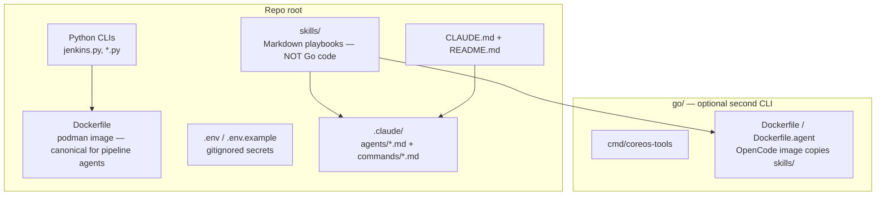

# CoreOS Agent Tools

CLI tools for monitoring and analyzing Red Hat CoreOS (RHCOS) infrastructure.

## Repository architecture

High-level map of how **runnable code**, **Claude personas**, and **skill playbooks** fit together (paths are repo-relative):



| Area | Purpose |
|------|---------|
| **`skills/`** | Claude/OpenCode **skill** folders (`SKILL.md` + helpers). Referenced by agents; kept separate from **`go/`** so it is obvious they are not compiled Go. |
| **`.claude/agents/`** | **@persona** markdown — routing lives in **`CLAUDE.md`**. |
| **`.claude/commands/`** | Slash-command definitions to copy into `~/.claude/commands/`. |
| **Root Python + `Dockerfile`** | Default **`podman run … jenkins.py`** path used in triage skills. |
| **`go/`** | Alternate **Go** implementation of Jenkins tooling; **`go/Dockerfile.agent`** builds the OpenCode/agent image and **`COPY skills/`** into the container. |

**Typical agentic flow (after GATE):** `@gitlab-similarity-search` → `@jira-similarity-search` → `@pipeline-handoff` (see **`CLAUDE.md`**).

## Tools

| Tool | Description |
|------|-------------|
| `coreos_pipeline_messages.py` | Fetch Slack messages from CoreOS pipeline channels |
| `jenkins.py` | Manage Jenkins jobs, builds, queue, and nodes |
| `process_rhcos_cves.py` | Process RHCOS CVEs from Jira and match with RHEL issues |
| `get_rhcos_image.py` | Retrieve RHCOS container image data for OCP versions |

## Quick Start

```bash
# Build container
podman build -t quay.io/cverna/coreos-agent-tools .

# Run with environment variables
podman run --rm --env-file .env quay.io/cverna/coreos-agent-tools <script> [options]
```

See `CLAUDE.md` for detailed usage examples and environment variable configuration.

## Go CLI

A Go implementation is available in the `go/` directory:

```bash
cd go
go build -o bin/coreos-tools ./cmd/coreos-tools
./bin/coreos-tools --help
```

## Claude Code integration

### Pipeline status (legacy)

Copy `coreos_pipeline_status.md` to `~/.claude/commands/` to use `/coreos_pipeline_status`.

### Agentic pipeline POC (`feature/pipeline-triage-workflow`)

This branch adds **ordered triage**, **named agents**, and **slash commands** for RHCOS Jenkins workflows. Full behavior is documented in **`CLAUDE.md`**.

**Prerequisites**

- [Claude Code](https://claude.ai/code) installed
- Podman (or Docker) and a `.env` with `JENKINS_URL`, `JENKINS_USER`, `JENKINS_API_TOKEN` (see `CLAUDE.md`)

**Setup (once per machine)**

```bash
# 1. Build the tools image (re-run after Dockerfile or script changes)
podman build -t quay.io/cverna/coreos-agent-tools .

# 2. Install slash commands for Claude Code
mkdir -p ~/.claude/commands
cp .claude/commands/pipeline-status.md ~/.claude/commands/
cp .claude/commands/pipeline-triage.md ~/.claude/commands/
# Optional: legacy pipeline summary
cp coreos_pipeline_status.md ~/.claude/commands/   # if you use /coreos_pipeline_status
```

### Optional: Jira MCP (Claude Code)

Lets Claude Code use **[mcp-atlassian](https://github.com/sooperset/mcp-atlassian)** so **`@jira-similarity-search`** and related flows can **search and view** issues on **issues.redhat.com** without a host `jira` CLI.

**You need:** [uv](https://docs.astral.sh/uv/) (for `uvx`), your **Atlassian account email**, and an **API token** from **id.atlassian.com → Security → Create and manage API tokens** (not a repo secret—create it in the browser).

**Register (example — replace placeholders; do not commit tokens):**

Use **`JIRA_PROJECTS_FILTER`** so MCP stays scoped to **COS** (CoreOS pipeline work) and does not pull your entire Jira footprint by default. Set **`JIRA_URL`** to the same host you use in the browser (`issues.redhat.com` vs `*.atlassian.net`—your org may use one or both).

```bash
claude mcp add jira \
  -e JIRA_URL=https://issues.redhat.com/ \
  -e JIRA_USERNAME='your-email@redhat.com' \
  -e JIRA_API_TOKEN='your-api-token' \
  -e JIRA_PROJECTS_FILTER=COS \
  -e READ_ONLY_MODE=true \
  -- uvx mcp-atlassian
```

Optional (see [mcp-atlassian configuration](https://github.com/sooperset/mcp-atlassian/blob/main/.env.example)): **`-e TOOLSETS=default`** for fewer tools, or **`-e ENABLED_TOOLS=...`** to allow only specific tool names if you want a minimal surface.

Add **`-s user`** after `claude mcp add` if you want this server in **user** scope instead of **local** (current-directory project config). Config is stored under your home directory (e.g. `~/.claude.json`); **never commit** files that contain tokens. If a token is ever pasted into a chat or shell history, **revoke it** and create a new one.

**Large MCP responses (~100k+ tokens):** Tools like **“Get all projects”** return **every** project you can access and can **fill the context window** in one call. **Do not** use them for connectivity checks. Prefer a **small JQL** search with a **low limit** (e.g. `project = COS ORDER BY updated DESC`, **max 3–5** issues). In prompts, say explicitly: *do not list all projects; only search with this JQL and limit N.*

**Verify read-only access (no Jira writes):**

1. `claude mcp list` — confirm **`jira`** appears.
2. Restart **Claude Code**, open this repo, and run a **read-only** prompt, for example:  
   *“Using Jira tools **only** to **search** and **read** issues: JQL `project = COS AND updated >= -7d ORDER BY updated DESC`, return at most **5** issues (**key + summary + status**). **Do not** list all projects. **Do not** create, edit, transition, or comment on any issue.”*
3. If you get real issue keys back, MCP auth is working.

**If `claude mcp list` says Connected but JQL search still fails:** Auth is often fine; **search** can break separately. Atlassian **Jira Cloud** deprecated older REST search endpoints; **mcp-atlassian** must be new enough to use the current search API. **Mitigations:** (1) Bump the MCP package—re-add the server using **`uvx --refresh-package mcp-atlassian mcp-atlassian`** (or `uvx mcp-atlassian@0.21.1` / newer from [PyPI](https://pypi.org/project/mcp-atlassian/)) so you are not stuck on a stale cache. (2) Install the host **`jira` CLI** (`brew install jira-cli`, then configure for your site—see [ankitpokhrel/jira-cli](https://github.com/ankitpokhrel/jira-cli)) so **`@jira-similarity-search`** can fall back when MCP search errors. (3) Last resort: run from git main if PyPI still lags—see the upstream repo.

**Write policy:** Pipeline agents in this repo are defined to **draft** handoffs and **not** change Jira unless **you** explicitly ask in-session; keep using that rule when testing MCP.

### GitLab failure tracker (PAT + API — no MCP)

For **`@gitlab-similarity-search`** and **`skills/pipeline-gitlab`**, set a **Personal Access Token** with at least **`read_api`** (see GitLab → **Preferences → Access tokens**). **Do not commit** the token.

Add the same variables to **`.env`** at the repo root (already **gitignored**), for example:

```bash
GITLAB_HOST=gitlab.cee.redhat.com
GITLAB_PROJECT=coreos/pipeline-failure-tracker
GITLAB_TOKEN=glpat-…
```

**Claude Code:** Bash tools often **do not inherit** exports from the terminal where you ran `claude`. **`@gitlab-similarity-search`** is instructed to **`source .env`** from the repo root before **`curl`** / **`glab`** (see **`skills/pipeline-gitlab`**). You can still `export` in the shell for manual `curl` tests.

If **`gitlab.cee.redhat.com` GitLab MCP OAuth** fails (e.g. invalid scope), this PAT + **`.env`** path is the **supported** integration—**`curl`** or **`glab api`** as in the skill.

**Run Claude Code** from the repo root (`claude`), then:

| Action | What to type |
|--------|----------------|
| Pipeline health / what to triage | `/pipeline-status` or ask: *What’s the current RHEL CoreOS Jenkins pipeline status?* |
| Deep triage for one build | `/pipeline-triage` then *job `build`, build `116`* — or `@pipeline-investigator triage job build, build 116` |
| Similar **GitLab** tracker issues (history / flakes — **run first**) | `@gitlab-similarity-search` with job, build, and error/classification (**`GITLAB_TOKEN`** / **`glab`** + **`.env`**; see above) |
| Similar existing COS issues (dedupe — **after GitLab**) | `@jira-similarity-search` with the same signals (Jira CLI/MCP in your environment) |
| Jira draft (no auto-create) | `@pipeline-handoff` with your triage summary |
| Next-step options | `@remediation-advisor` after triage |
| Group failures by root cause | `@cross-build-analyst` (see `.claude/agents/cross-build-analyst.md`) |

**Repo layout for agents**

- `.claude/agents/*.md` — personas (monitor, investigator, Jira + **GitLab** similarity search, handoff, remediation, cross-build analyst)
- `skills/pipeline-triage-workflow/SKILL.md` — staged Jenkins triage (Gather → Logs → Classify → Summarize → **GATE**); **@gitlab-similarity-search** → **@jira-similarity-search** → **@pipeline-handoff**
- `skills/pipeline-failures`, `pipeline-jira`, **`pipeline-gitlab`**, etc. — domain playbooks the agents reference

`~/.claude/commands/` only registers slash commands; **source files stay in this repo** so the team can review them in PRs.